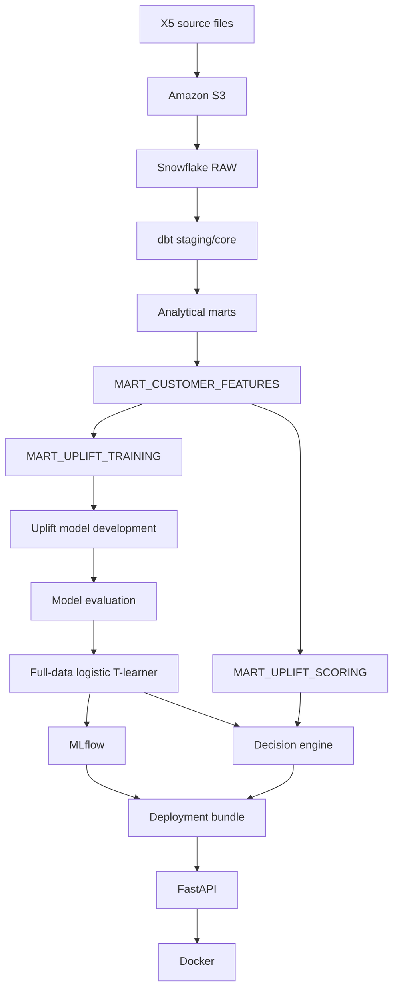
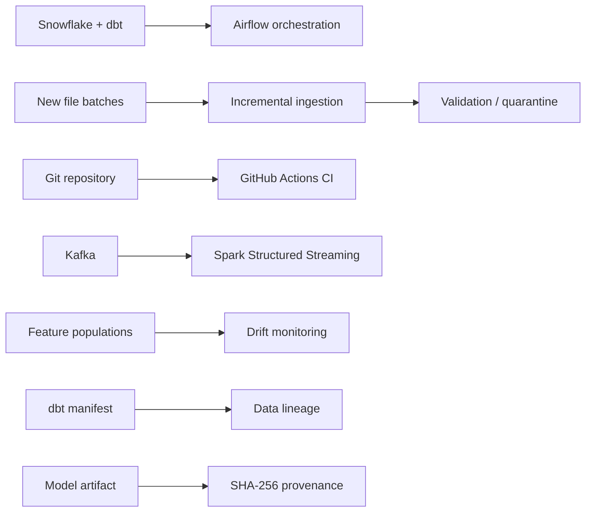

# Retail Growth Decision Platform

An end-to-end data and machine-learning platform built around the X5 RetailHero benchmark dataset. The project connects raw retail data, warehouse modeling, uplift modeling, economic decisioning, model serving, orchestration, continuous integration, streaming, drift monitoring, and governance into one coherent system.

The central goal is not simply to train a model. It is to show how a model fits inside a reliable decision system:

```text
raw data
  ↓
warehouse
  ↓
features
  ↓
uplift model
  ↓
economic decision policy
  ↓
serving
  ↓
monitoring + governance
```

## What the platform does

The historical X5 workflow loads the five source files into Snowflake, transforms them with dbt, creates customer-level feature marts, estimates heterogeneous treatment uplift, and applies an explicit budget-constrained contact policy. The selected model is tracked with MLflow, exported into a deployment bundle, served through FastAPI, and packaged with Docker.

Reliability layers surround that core workflow. Airflow orchestrates the warehouse refresh, GitHub Actions validates code changes, incremental-ingestion controls demonstrate idempotent file processing, Kafka and Spark Structured Streaming demonstrate event-driven processing, drift monitoring checks changes in model inputs and predicted uplift, and governance utilities trace dbt lineage and fingerprint the model artifact.

Synthetic incremental-ingestion and streaming demonstrations are intentionally isolated from the historical X5 modeling pipeline. They are not used to retrain the uplift model or calculate historical business metrics.

## Architecture at a glance



Supporting controls:



For the complete architecture and system boundaries, see [`docs/system_architecture.md`](docs/system_architecture.md).

## Dataset and warehouse scale

| Component | Verified size |
|---|---:|
| Customers | 400,162 |
| Products | 43,038 |
| Raw purchase-item rows | 45,786,568 |
| Validated customer transactions | 8,045,229 |
| Uplift training customers | 200,039 |
| Uplift scoring customers | 200,123 |
| Customer feature mart | 400,162 |

The purchase source contains two logical grains. A transaction is identified by `(transaction_id, client_id)`, because `transaction_id` is not globally unique across customers. An item record is identified by `(transaction_id, client_id, product_id)`.

The full field-level reference, data-quality findings, warehouse grains, marts, feature definitions, and unresolved source semantics are documented in [`docs/data_dictionary.md`](docs/data_dictionary.md).

## Modeling approach

The project uses a T-learner design with independent treatment and control outcome models:

```text
predicted uplift = P(Y=1 | X, treatment) - P(Y=1 | X, control)
```

The final decisioning model is a logistic-regression T-learner. On the development holdout it produced:

| Metric | Result |
|---|---:|
| Treatment ROC-AUC | 0.765062 |
| Control ROC-AUC | 0.772814 |
| Treatment Brier score | 0.186098 |
| Control Brier score | 0.188313 |
| Qini | 168.366182 |
| Observed uplift in top 30% | 0.063582 |

A boosted T-learner produced stronger ordinary classification metrics, while the logistic model produced the stronger Qini and top-30% uplift results used for the project's treatment-selection objective.

The public materials used in the project do not establish that treatment assignment was randomized. Observed balance and a near-random propensity classifier support comparability on measured features, but they do not prove randomization or eliminate unobserved confounding. See [`docs/causal_assumptions.md`](docs/causal_assumptions.md) and [`docs/model_card.md`](docs/model_card.md).

## Economic decisioning

Model scores are converted into an explicit economic policy rather than treated as the final product. The main demonstration uses:

| Assumption / result | Value |
|---|---:|
| Conversion value | 20.00 |
| Contact cost | 0.25 |
| Budget | 10,000.00 |
| Customers selected | 40,000 |
| Modeled incremental conversions | 3,291.91 |
| Modeled incremental value | 65,838.15 |
| Contact spend | 10,000.00 |
| Modeled net value | 55,838.15 |

These are prediction-based estimates under illustrative economic assumptions, not realized campaign outcomes.

## Reliability and ML engineering

The project includes the following engineering controls:

- **dbt tests and contracts** for warehouse integrity and the fixed X5 snapshot.
- **Airflow** for a four-task warehouse refresh: connection check → snapshot validation → dbt build → build verification.
- **Incremental ingestion** with source preservation, validation, quarantine, and idempotent trusted-event promotion.
- **GitHub Actions CI** for repository hygiene, Python syntax, unit tests, dbt parsing, and Docker image construction.
- **Kafka + Spark Structured Streaming** for a separate event-driven demonstration with offsets, checkpoints, watermarks, quarantine handling, and stateful deduplication.
- **Data/model drift monitoring** using PSI, SMD, missingness deltas, prediction drift, and downstream policy comparison.
- **Governance** using the dbt manifest for lineage, a model card for intended-use documentation, and SHA-256 for exact artifact fingerprinting.

## Verified operational results

### Orchestrated dbt build

- 4 Airflow tasks passed.
- 64 dbt resources completed successfully.
- 17 resources reported `success`.
- 47 tests reported `pass`.
- 3 required modeling marts were verified.

### Streaming demonstration

- 7 Kafka messages published.
- 4 trusted unique events produced.
- 2 invalid events quarantined.
- 1 duplicate suppressed.

### Drift monitoring

Across the X5 development and scoring populations:

- 34 model features monitored.
- 34 features classified `OK`.
- 0 `WARNING` features.
- 0 `CRITICAL` features.
- Highest feature PSI: 0.000204.
- Prediction PSI: 0.000086 (`OK`).

A controlled synthetic shift triggered 2 `CRITICAL` feature alerts, 1 `WARNING` feature alert, and prediction PSI of 0.17661 (`WARNING`), demonstrating that the detector responds to known distribution movement.

### Governance and warehouse-efficiency audit

- 3 ML-adjacent dbt lineage targets traced.
- 40 lineage resources recovered.
- 34-feature model contract recorded.
- SHA-256 fingerprint generated for the trusted model artifact.
- 150 successful Snowflake queries inspected over a 6-day window.
- Total successful-query elapsed time: 164.00 seconds.
- Total data scanned: 12.387 GB.
- Largest individual scan: 2.309 GB.

Query duration and bytes scanned are efficiency indicators, not exact Snowflake billing measurements.

## Repository map

```text
retail-growth-decision-platform/
├── .github/workflows/        # GitHub Actions CI
├── api/                      # FastAPI serving application + Dockerfile
├── data/                     # Local/generated artifacts; most subfolders ignored
├── dbt/                      # dbt project, models, tests, generated target artifacts
├── docs/                     # Architecture, data dictionary, model card, assumptions
├── notebooks/                # Numbered end-to-end project notebooks
├── orchestration/dags/       # Airflow DAG
├── scripts/                  # Reusable operational and validation scripts
├── sql/                      # Manual Snowflake setup/audit/validation SQL
├── src/                      # Reusable decisioning, drift, and governance logic
├── streaming/                # Kafka + Spark local streaming demonstration
├── tests/                    # Python unit tests
├── .gitignore
├── README.md
└── requirements.txt
```

For a detailed explanation of where each component lives, which files are generated, and how the major workflows are run, see [`docs/repository_guide.md`](docs/repository_guide.md).

## Documentation

| Document | Purpose |
|---|---|
| [`docs/system_architecture.md`](docs/system_architecture.md) | End-to-end architecture, component boundaries, reliability layers, and tradeoffs |
| [`docs/data_dictionary.md`](docs/data_dictionary.md) | Source fields, grains, warehouse models, marts, feature definitions, and data-quality findings |
| [`docs/model_card.md`](docs/model_card.md) | Model purpose, evaluation, causal limitations, monitoring, and intended use |
| [`docs/causal_assumptions.md`](docs/causal_assumptions.md) | Assumptions required for causal interpretation |
| [`docs/repository_guide.md`](docs/repository_guide.md) | Repository navigation, generated artifacts, and common workflows |

## Reproducibility boundaries

The repository intentionally does not commit credentials, local virtual environments, warehouse extracts, model artifacts, MLflow state, deployment bundles, Airflow state, streaming outputs/checkpoints, synthetic generated files, monitoring outputs, or governance outputs.

Examples of ignored local paths include:

```text
.env
project_env/
airflow_env/
streaming_env/
data/processed/
data/models/
data/mlflow/
data/deployment/
data/airflow/
data/synthetic/
data/streaming/
data/monitoring/
data/governance/
```

The code that creates or validates those artifacts remains version controlled.

## Project limitations

This is a portfolio-scale technical system built on a historical benchmark, not a live production retailer. The scoring population does not include observed treatment outcomes, so post-deployment uplift-performance drift cannot be measured directly. The economic assumptions are illustrative. The incremental and streaming datasets are synthetic. MLflow tracking and the Kafka/Spark demonstration are local rather than managed multi-user services. Enterprise controls such as production IAM design, centralized logging, distributed tracing, formal approval workflows, disaster recovery, and regulatory retention policies remain outside the project scope.

## Start here

If you are reviewing the repository for the first time, read the files in this order:

1. `README.md`
2. `docs/system_architecture.md`
3. `docs/model_card.md`
4. `docs/data_dictionary.md`
5. `docs/repository_guide.md`
6. the numbered notebooks for implementation detail

The notebooks show how the platform was built. The documentation files describe the final system.
