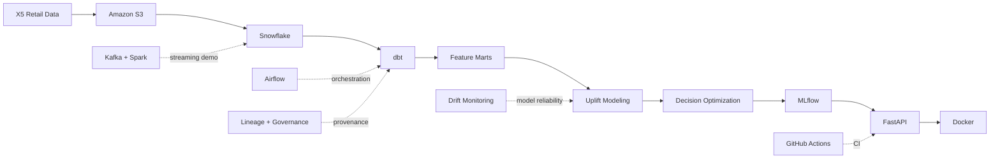
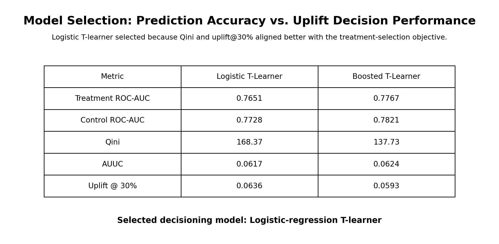
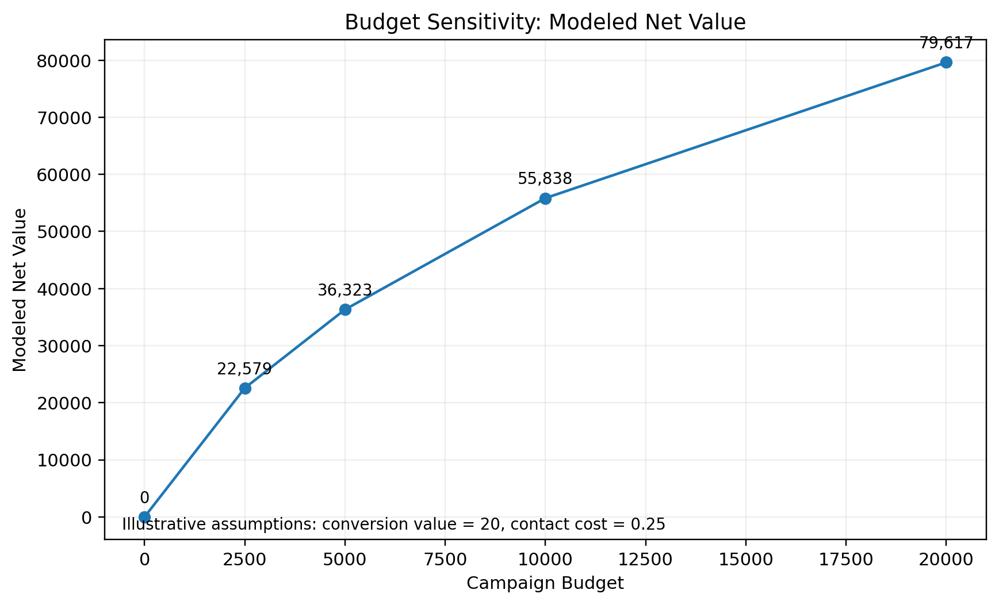
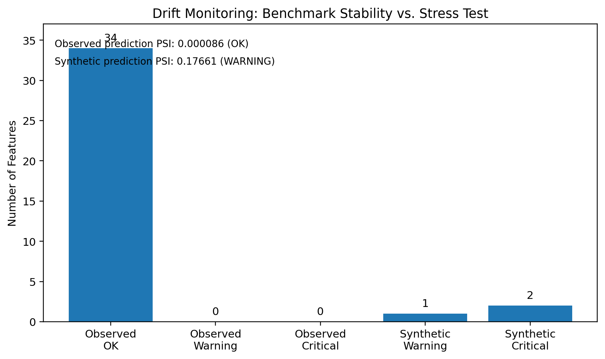

# Retail Growth Decision Platform

## End-to-End Uplift Modeling & Decision Platform

An end-to-end retail data and machine-learning platform that transforms more than **45.7 million transaction-product records** into customer-level features, estimates heterogeneous treatment uplift, and converts model predictions into budget-constrained treatment decisions.

The project extends beyond model development into data engineering, decision science, MLOps, orchestration, streaming, monitoring, and governance.

---

## Key Results

| Area | Result |
|---|---:|
| Raw purchase-item records | **45,786,568** |
| Customer transactions | **8,045,229** |
| Customers | **400,162** |
| Model features | **34** |
| Development Qini | **168.37** |
| Top-30% observed uplift | **6.36 pp** |
| Customers selected under main policy | **40,000** |
| Modeled incremental conversions | **3,291.91** |
| Modeled net value | **55,838.15** |
| dbt resources validated | **64** |
| Model features within normal drift range | **34 / 34** |

> Modeled decision values are prediction-based estimates under illustrative economic assumptions rather than realized campaign results.

---

## Platform Architecture

The historical X5 workflow remains the source of truth for model development.

Incremental-ingestion and Kafka/Spark workflows use isolated synthetic data and do not modify the historical X5 training population or business metrics.

For the detailed system architecture, see [`docs/system_architecture.md`](docs/system_architecture.md).

---

## What I Built

### Data Engineering

**Amazon S3 → Snowflake → dbt → analytical and ML feature marts**

The warehouse preserves raw source data separately from trusted analytical transformations.

The pipeline includes customer and product dimensions, transaction facts, analytical marts, customer-level features, and dedicated uplift-training and scoring populations.

### Data Science

**Feature engineering → uplift modeling → causal diagnostics → model comparison → drift monitoring**

The project compares treatment and control outcome models and evaluates whether model rankings identify customers with larger observed differences in treatment response.

### Decision Science

**Predicted uplift → modeled economic value → budget-constrained contact policy**

The model is not treated as the final output.

Predicted treatment uplift is converted into an actionable contact policy using conversion value, contact cost, and a campaign budget.

### ML Engineering

**MLflow → deployment bundle → FastAPI → Docker**

The selected model is tracked, fingerprinted, exported into a portable deployment bundle, served through an API, and packaged into a reproducible Docker container.

### Reliability & Governance

**Airflow → data contracts → GitHub Actions → Kafka/Spark → drift monitoring → lineage → artifact provenance**

The project includes workflow orchestration, automated testing, incremental-ingestion controls, streaming demonstrations, model monitoring, data lineage, and model-artifact governance.

---

## Why Uplift Modeling?

Traditional response modeling asks:

> Which customers are most likely to convert?

This project asks a different question:

> Which customers are more likely to convert **because they receive the treatment**?

A T-learner estimates:

`P(Y = 1 | X, treatment)`

and:

`P(Y = 1 | X, control)`

Predicted uplift is:

`P(Y = 1 | X, treatment) - P(Y = 1 | X, control)`

This distinction matters because a customer with a high conversion probability may have converted even without treatment.

The decision system therefore prioritizes estimated incremental impact rather than response probability alone.

---

## Model Selection

I compared logistic-regression and gradient-boosted T-learners using the same development holdout.

The boosted model produced stronger ordinary outcome-prediction ROC-AUC and Brier scores. However, the logistic T-learner produced stronger **Qini** and **top-30% uplift**, which were more closely aligned with the downstream treatment-selection objective.

The **logistic-regression T-learner** was therefore selected for decisioning.

This illustrates an important modeling tradeoff: the model with the strongest ordinary predictive accuracy is not necessarily the model that best supports an incremental-treatment decision.

---

## From Prediction to Decision

Predicted uplift is converted into modeled economic value:

`modeled net value = predicted uplift × conversion value − contact cost`

Main demonstration assumptions:

- Conversion value: **20**
- Contact cost: **0.25**
- Campaign budget: **10,000**
- Customers selected: **40,000**
- Modeled incremental conversions: **3,291.91**
- Modeled incremental value: **65,838.15**
- Contact spend: **10,000**
- Modeled net value: **55,838.15**

The budget-sensitivity analysis shows how modeled incremental value changes as campaign capacity increases.

These values are model-based scenario estimates rather than realized campaign outcomes.

---

## Data & Model Drift Monitoring

Across the benchmark development and scoring populations:

- Model features monitored: **34**
- Features with OK status: **34**
- WARNING features: **0**
- CRITICAL features: **0**
- Highest observed feature PSI: **0.000204**
- Prediction PSI: **0.000086**
- Prediction drift status: **OK**

A controlled synthetic stress test then deliberately shifted:

- `transaction_count_30d`
- `total_purchase_value`
- `gender`

The monitoring system produced:

- **2 CRITICAL** feature alerts
- **1 WARNING** feature alert
- Synthetic prediction PSI: **0.17661**
- Synthetic prediction drift status: **WARNING**

The stress test demonstrates that the monitoring logic can distinguish a stable population comparison from a deliberately shifted population.

---

## Data Reliability

The project includes two isolated demonstrations for handling newly arriving data.

### Incremental Batch Ingestion

New synthetic files are:

`S3 → raw landing → validation → trusted events / quarantine`

The workflow demonstrates:

- source-level provenance
- schema validation
- invalid-record quarantine
- duplicate protection
- idempotent promotion

### Event Streaming

Synthetic events are processed through:

`Kafka → Spark Structured Streaming → validation → deduplication → trusted / quarantine outputs`

The streaming demonstration includes:

- Kafka topics
- partitions
- offsets
- Spark checkpoints
- event-time watermarks
- stateful event-ID deduplication

Synthetic ingestion and streaming data remain separate from the historical X5 modeling pipeline.

---

## Reproducibility & Reliability

### Airflow

Airflow coordinates the Snowflake/dbt warehouse refresh.

The successful workflow executed:

- **4 DAG tasks**
- **64 dbt resources**
- **17 successful model/resource executions**
- **47 passing dbt tests**
- **3 required ML marts verified**

### GitHub Actions

CI automatically checks:

- repository hygiene
- Python syntax
- Python unit tests
- dbt static parsing
- FastAPI Docker image construction

The CI workflow runs on a clean environment without requiring Snowflake or AWS credentials.

### MLflow

MLflow records model provenance and allows the serving models to be reloaded and checked against the original prediction outputs.

### Governance

The project also includes:

- dbt lineage extraction
- a 34-feature model contract
- SHA-256 model-artifact fingerprinting
- model documentation
- warehouse query-efficiency auditing

---

## Technology Stack

| Layer | Technologies |
|---|---|
| Storage | Amazon S3 |
| Warehouse | Snowflake |
| Transformation | dbt |
| Analysis / ML | Python, pandas, NumPy, scikit-learn |
| Experiment tracking | MLflow |
| API serving | FastAPI, Uvicorn |
| Containerization | Docker |
| Orchestration | Apache Airflow |
| CI | GitHub Actions |
| Streaming | Apache Kafka, Spark Structured Streaming |
| Monitoring | PSI, SMD, missingness and prediction drift |
| Governance | dbt manifest lineage, SHA-256 provenance |

---

## Explore the Project

| Area | Resource |
|---|---|
| System architecture | [`docs/system_architecture.md`](docs/system_architecture.md) |
| Data dictionary | [`docs/data_dictionary.md`](docs/data_dictionary.md) |
| Model card | [`docs/model_card.md`](docs/model_card.md) |
| Causal assumptions | [`docs/causal_assumptions.md`](docs/causal_assumptions.md) |
| Repository guide | [`docs/repository_guide.md`](docs/repository_guide.md) |
| Data audit | [`notebooks/01_data_audit.ipynb`](notebooks/01_data_audit.ipynb) |
| Uplift baseline | [`notebooks/02_uplift_baseline.ipynb`](notebooks/02_uplift_baseline.ipynb) |
| Model evaluation | [`notebooks/03_uplift_model_evaluation.ipynb`](notebooks/03_uplift_model_evaluation.ipynb) |
| Treatment decisioning | [`notebooks/04_treatment_decisioning.ipynb`](notebooks/04_treatment_decisioning.ipynb) |
| MLflow reproducibility | [`notebooks/06_mlflow_tracking.ipynb`](notebooks/06_mlflow_tracking.ipynb) |
| Model serving | [`notebooks/07_model_serving.ipynb`](notebooks/07_model_serving.ipynb) |
| Pipeline orchestration | [`notebooks/08_pipeline_orchestration.ipynb`](notebooks/08_pipeline_orchestration.ipynb) |
| Incremental ingestion | [`notebooks/09_incremental_ingestion.ipynb`](notebooks/09_incremental_ingestion.ipynb) |
| CI quality gates | [`notebooks/10_ci_quality_gates.ipynb`](notebooks/10_ci_quality_gates.ipynb) |
| Kafka + Spark streaming | [`notebooks/11_stream_processing.ipynb`](notebooks/11_stream_processing.ipynb) |
| Data/model drift | [`notebooks/12_data_model_drift.ipynb`](notebooks/12_data_model_drift.ipynb) |
| Governance & lineage | [`notebooks/13_governance_lineage_cost.ipynb`](notebooks/13_governance_lineage_cost.ipynb) |
| End-to-end evaluation | [`notebooks/14_end_to_end_platform.ipynb`](notebooks/14_end_to_end_platform.ipynb) |

---

## Important Limitations

The project uses the historical X5 RetailHero benchmark rather than a live retail production system.

The public materials used in this project do not establish that treatment assignment was randomized. Strong observed covariate balance does not rule out unobserved confounding.

The X5 scoring population does not contain observed treatment outcomes, so true post-deployment uplift-performance drift cannot be measured.

Economic assumptions such as conversion value, contact cost, and campaign budget are illustrative.

The incremental-ingestion and streaming workflows use synthetic data and are intentionally isolated from historical X5 model development.

The serving environment is a reproducible local/containerized demonstration rather than a production multi-region service.

---

## Project Goal

The goal of this project is not simply to train an uplift model.

It is to connect:

`raw data → warehouse → features → model → decision → serving → monitoring → governance`

into one coherent decision platform while keeping the assumptions and limitations of each stage explicit.