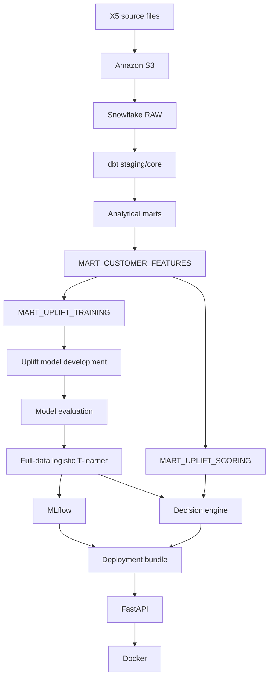
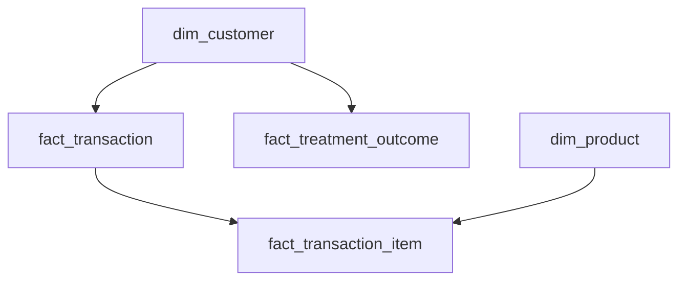
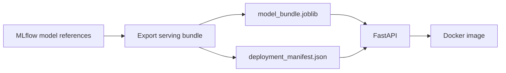
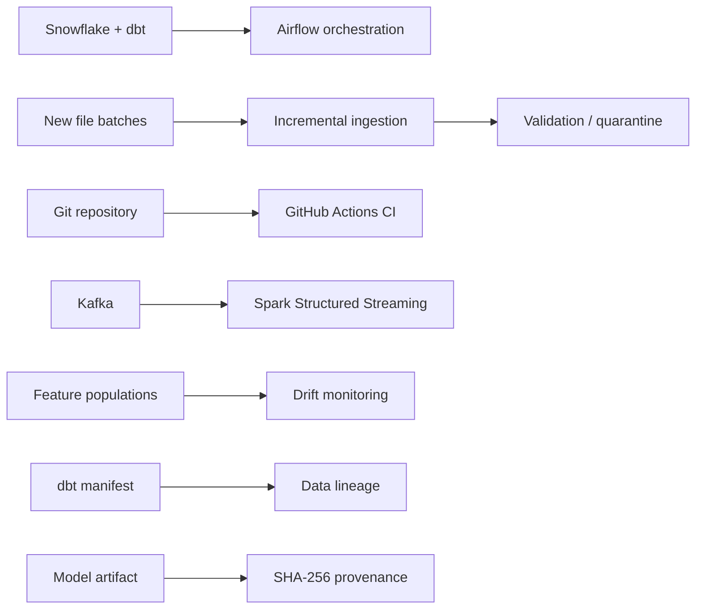

# Retail Growth Decision Platform — System Architecture

## Overview

The Retail Growth Decision Platform is an end-to-end data and machine-learning system built around the X5 RetailHero benchmark dataset.

The platform transforms raw retail transactions into customer-level features, estimates heterogeneous treatment uplift, applies economic decision rules, packages the selected model for serving, and adds orchestration, testing, monitoring, and governance controls around the workflow.

The historical X5 path is the source of truth for model development. Synthetic incremental-ingestion and streaming paths are separate engineering demonstrations and never feed the historical X5 marts, model training, or reported business metrics.

## 1. Core historical architecture



The architecture deliberately separates historical data preparation, model development, scoring, and serving. Development metrics belong to the held-out development models; the later full-data logistic T-learner is refit for scoring and does not have an independent labeled holdout of its own.

## 2. Data layer

### Source files

The historical source contains five files:

- `clients`
- `products`
- `purchases`
- `uplift_train`
- `uplift_test`

They are stored in private Amazon S3 and loaded into `RETAIL_GROWTH.RAW` through a Snowflake storage integration and external stage.

The raw layer preserves source values rather than destructively cleaning them. Raw tables also retain ingestion metadata such as source filename, source row number, and load timestamp.

### Validated grains

The purchase source contains two logical grains.

**Transaction grain:** one row per `(transaction_id, client_id)`.

`transaction_id` alone is not globally unique: 28 source transaction IDs are reused across distinct customers. A stable `transaction_key` is therefore derived from the validated composite business key.

**Transaction-item grain:** one row per `(transaction_id, client_id, product_id)`.

The warehouse separates transaction-level monetary/loyalty fields from item-level product fields to avoid double counting.

### Core warehouse model



Core row counts:

| Model | Grain | Rows |
|---|---|---:|
| `dim_customer` | one row per client | 400,162 |
| `dim_product` | one row per product | 43,038 |
| `fact_transaction` | one row per `(transaction_id, client_id)` | 8,045,229 |
| `fact_transaction_item` | one row per `(transaction_id, client_id, product_id)` | 45,786,568 |
| `fact_treatment_outcome` | one row per uplift-training client | 200,039 |

### Analytical marts

The dbt layer creates reusable analytical models rather than forcing every downstream workflow to aggregate raw facts independently.

| Mart | Purpose | Rows |
|---|---|---:|
| `mart_customer_activity` | customer transaction/activity profile | 400,162 |
| `mart_purchase_daily` | daily purchase monitoring | 118 |
| `mart_product_performance` | product activity/performance profile | 43,038 |
| `mart_customer_360` | consolidated customer analytical view | 400,162 |
| `mart_customer_features` | model-ready customer features | 400,162 |
| `mart_uplift_training` | features + treatment/outcome for development | 200,039 |
| `mart_uplift_scoring` | features for the unlabeled scoring population | 200,123 |

The feature cutoff is `2019-03-19 00:00:00`, and validation confirmed that no purchase transactions occur at or after that cutoff.

## 3. Modeling layer

A T-learner estimates treatment and control outcome probabilities independently:

```text
p_treatment = P(Y=1 | X, treatment)
p_control   = P(Y=1 | X, control)

predicted uplift = p_treatment - p_control
```

The final decisioning model is a logistic-regression T-learner.

Development-holdout results:

| Metric | Logistic T-learner |
|---|---:|
| Treatment ROC-AUC | 0.765062 |
| Control ROC-AUC | 0.772814 |
| Treatment Brier | 0.186098 |
| Control Brier | 0.188313 |
| Qini | 168.366182 |
| Uplift at top 30% | 0.063582 |

A HistGradientBoosting T-learner produced stronger ordinary outcome-prediction metrics and slightly higher AUUC under the project's definition, while the logistic T-learner produced the stronger Qini and top-30% uplift used for the decisioning objective.

### Causal boundary

The public source materials used in this project do not establish randomized treatment assignment. Observed covariates are highly balanced, and an out-of-fold propensity classifier produced ROC-AUC near 0.5, but those findings do not prove randomization or rule out unmeasured confounding.

The causal assumptions and limitations are documented separately in `docs/causal_assumptions.md` and `docs/model_card.md`.

## 4. Decision layer

The platform does not stop at predicted uplift. It converts predicted incremental response into an economic decision rule.

For each customer:

```text
modeled incremental value = predicted_uplift × conversion_value
modeled net value         = modeled incremental value - contact_cost
```

The policy selects customers with positive modeled net value subject to the campaign budget.

Primary demonstration assumptions:

- conversion value = 20
- contact cost = 0.25
- budget = 10,000

Scoring-policy result:

- contacts selected = 40,000
- modeled incremental conversions = 3,291.91
- modeled incremental value = 65,838.15
- contact spend = 10,000
- modeled net value = 55,838.15

These values are prediction-based and use illustrative economics. They are not realized campaign outcomes.

## 5. Reproducibility and model provenance

### MLflow

MLflow records model references and reproducibility metadata. The serving bundle is exported from the tracked treatment and control models rather than retraining during deployment.

The project distinguishes between two types of evidence:

- development-holdout performance belongs to the subset-trained evaluation models;
- the full-data scoring model is refit on all 200,039 training customers and is used for scoring, but has no independent labeled holdout of its own.

### Artifact fingerprinting

The trusted scoring artifact is fingerprinted with SHA-256. The checksum identifies the exact artifact bytes, independent of filename.

The governance layer also records:

- model family
- feature count
- feature cutoff
- dbt lineage targets
- feature contract

## 6. Serving layer



FastAPI exposes:

- `GET /health`
- `GET /model-info`
- `POST /score`
- `POST /decide`

The API validates the feature contract, restricts request size, verifies model provenance, scores treatment/control probabilities, calculates uplift, and reuses the shared decision-engine implementation.

Docker packages the API runtime. The deployment artifact itself remains outside Git and is mounted at runtime.

## 7. Reliability architecture



### Airflow orchestration

The warehouse refresh DAG is intentionally manual for the fixed benchmark snapshot. It executes:

```text
check_snowflake_connection
        ↓
validate_x5_snapshot
        ↓
build_warehouse_and_features
        ↓
verify_dbt_results
```

The final successful run executed all four tasks. The dbt build contained 64 resources: 17 `success` results and 47 passing tests. Three required modeling marts were verified.

### Incremental-ingestion demonstration

A separate synthetic file-ingestion path demonstrates:

- schema/header contract checking
- raw source preservation
- source-file and source-row provenance
- parsing with explicit validation
- quarantine of invalid rows
- duplicate protection at the business-event level
- idempotent promotion into a trusted table

This path is isolated from the historical X5 warehouse.

### GitHub Actions CI

CI runs on a clean GitHub-hosted runner and validates:

- repository hygiene
- Python syntax
- unit tests
- dbt static parsing
- FastAPI Docker image construction

It deliberately does not require Snowflake, AWS, Airflow runtime state, or local MLflow state.

### Kafka and Spark Structured Streaming

A separate event-driven demonstration publishes synthetic purchase-like events to Kafka and processes them with Spark Structured Streaming.

The demonstration covers:

- Kafka topic partitions and offsets
- JSON parsing
- contract validation
- trusted/quarantine separation
- Spark checkpoints
- event-time watermarks
- stateful event-ID deduplication

Initial run:

- 7 Kafka messages
- 4 trusted unique events
- 2 quarantined events
- 1 duplicate suppressed

This path demonstrates streaming architecture; it is not part of the historical X5 training pipeline.

## 8. Drift monitoring

The model reliability layer compares a reference population with a current population using:

- Population Stability Index (PSI)
- Standardized Mean Difference (SMD)
- missingness deltas
- predicted-uplift distribution drift
- downstream policy summaries

The project-level PSI alert rules are operational heuristics rather than universal statistical laws:

```text
PSI < 0.10          → OK
0.10 ≤ PSI < 0.25   → WARNING
PSI ≥ 0.25          → CRITICAL
```

Observed X5 development-versus-scoring comparison:

- 34 features monitored
- 34 `OK`
- 0 `WARNING`
- 0 `CRITICAL`
- highest feature PSI = 0.000204
- prediction PSI = 0.000086 (`OK`)

Controlled synthetic shift:

- `transaction_count_30d`: PSI 16.7722 (`CRITICAL`)
- `total_purchase_value`: PSI 0.3343 (`CRITICAL`)
- `gender`: PSI 0.1438 (`WARNING`)
- synthetic prediction PSI = 0.17661 (`WARNING`)

A drift alert is an investigation signal. It does not prove that predictive or causal performance has degraded.

## 9. Governance and lineage

The governance layer uses dbt's `manifest.json` to trace the feature marts through their upstream transformations and declared sources.

Primary lineage targets:

- `mart_customer_features`
- `mart_uplift_training`
- `mart_uplift_scoring`

The final governance audit recovered 40 target/upstream lineage resources across these targets.

A model card documents intended use, evaluation, causal limitations, decision assumptions, monitoring, and known limitations.

## 10. Warehouse efficiency controls

Recent Snowflake query history is inspected to identify resource-intensive workloads.

Six-day successful-query audit:

- 150 successful queries inspected
- total elapsed execution time = 164.00 seconds
- average query duration = 1.09 seconds
- slowest query duration = 26.22 seconds
- total data scanned = 12.387 GB
- largest individual scan = 2.309 GB
- average data scanned per successful query = 84.56 MB

Execution time and bytes scanned are efficiency signals, not exact dollar-cost attribution.

## 11. Batch vs incremental vs streaming

The project intentionally uses different processing patterns for different arrival modes.

| Pattern | Use in project | Why |
|---|---|---|
| Full historical rebuild | X5 warehouse/model workflow | Source is a fixed benchmark snapshot |
| Incremental file ingestion | Synthetic S3/Snowflake demo | Demonstrates safe arrival of new file batches |
| Event streaming | Synthetic Kafka/Spark demo | Demonstrates continuously arriving events |

Kafka and Spark are not forced into the historical X5 pipeline simply to add technologies. They are used where event-driven semantics make sense.

## 12. System boundaries

The project is a portfolio-scale technical system rather than a production retail platform.

It does not claim:

- verified randomized treatment assignment
- realized economic campaign returns
- post-deployment causal performance without recent outcomes
- production multi-region serving
- enterprise IAM/secrets governance
- centralized logging or distributed tracing
- disaster recovery or regulatory-retention implementation

These boundaries are documented explicitly so that technical demonstrations are not presented as capabilities the source data or infrastructure cannot support.
